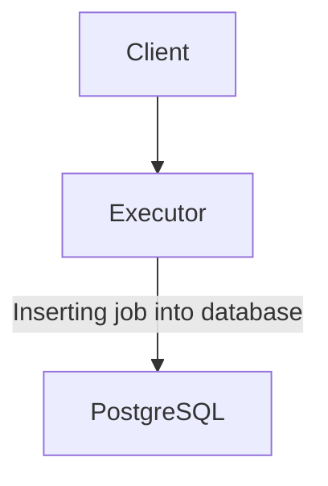
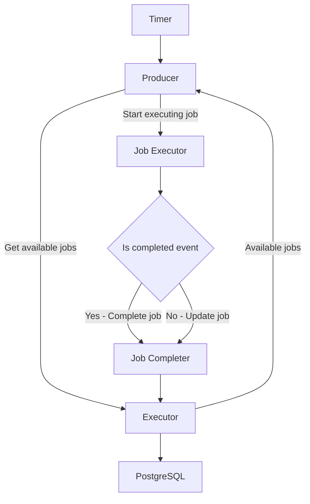
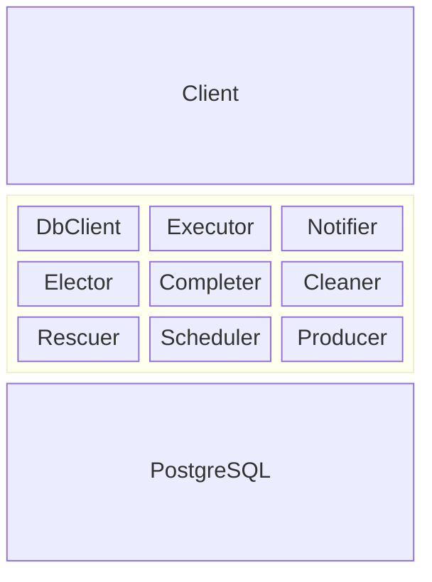

# Architecture

## Inserting Jobs

```mermaid
flowchart TD
    A["Client"] --> B["Executor"]
    B -- "Inserting job into database"--> C["PostgreSQL"]
```

## Processing Jobs

```mermaid
flowchart TD
    A["Timer"] --> B["Producer"]
    B -- "Get available jobs"--> C["Executor"]
    C -- "Available jobs" --> B
    B -- "Start executing job" --> D["Job Executor"]
    D --> E{Is completed event}
    E -- Yes - Complete job --> F[Job Completer]
    F --> C
    E -- No - Update job --> F
    C --> G[PostgreSQL]
```

## Components

```mermaid
block-beta
    columns 3
    Client:3

    block:group1:3
        columns 3
        DbClient Executor Notifier
        Elector Completer Cleaner
        Rescuer Scheduler Producer
    end

    PostgreSQL:3
```
