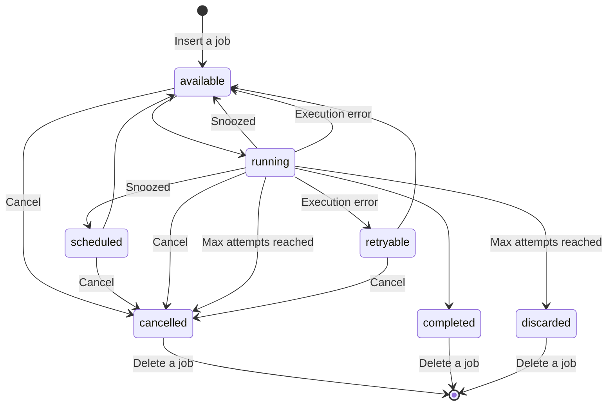

# States

Currently jobs in PidginMQ have 7 possible states:

- available - job is available for execution
- cancelled - job is cancelled
- completed - job is successfully completed
- discarded - job was stuck and reached max number of attempts. Because of that it was discarded
- retryable - job is ready to be retried
- running - job is currently being executed
- scheduled - job is scheduled for execution

## State Diagram

