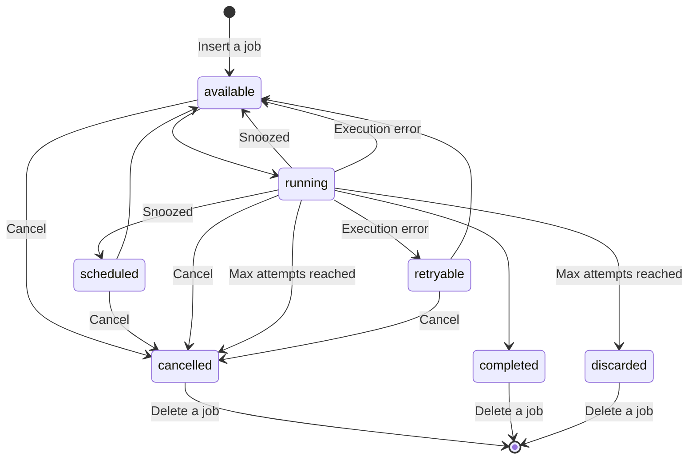

# States

Currently, jobs in PidginMQ have 7 possible states:

- **available** - a job is available for execution.
- **cancelled** - a job is cancelled.
- **completed** - a job is successfully completed.
- **discarded** - a job was stuck and reached the maximum number of attempts. Because of that, it was discarded.
- **retryable** - a job is ready to be retried.
- **running** - a job is currently being executed.
- **scheduled** - a job is scheduled for execution.

## State Diagram

